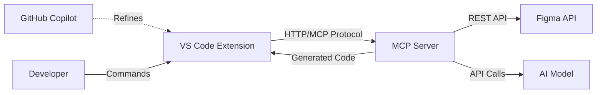

# FigmaFlow-MCP Development Plan

Comprehensive development plan for building an AI-powered bridge between Figma designs and Flutter development, integrated with VS Code and GitHub Copilot.

## Project Overview

**Product:** Figma MCP for GitHub Copilot (VS Code)  
**Goal:** Enable developers to convert Figma designs into Flutter UI code, widget tests, and QA test cases directly in VS Code  
**Target MVP Duration:** 8-10 weeks  
**Tech Stack:** Python (MCP Server), TypeScript (VS Code Extension), Flutter (Target Output)

---

## Architecture Overview



**Core Components:**
1. **VS Code Extension** - User interface and command integration
2. **MCP Server** - Orchestration, AI invocation, code generation
3. **Figma API Client** - Design data fetching and parsing
4. **AI Generation Engine** - Prompt engineering and code synthesis

---

## Phase 1: Foundation & Setup (Week 1)

### 1.1 Project Initialization

#### MCP Server Repository
**Location:** `figmaflow-mcp-server/`

```
figmaflow-mcp-server/
├── src/
│   ├── mcp/
│   │   ├── __init__.py
│   │   ├── server.py          # MCP server core
│   │   └── tools.py           # Tool definitions
│   ├── figma/
│   │   ├── __init__.py
│   │   ├── client.py          # Figma API client
│   │   └── parser.py          # Design data parser
│   ├── generators/
│   │   ├── __init__.py
│   │   ├── widget.py          # Flutter widget generator
│   │   ├── test.py            # Widget test generator
│   │   └── qa.py              # QA test case generator
│   ├── ai/
│   │   ├── __init__.py
│   │   ├── client.py          # AI model client
│   │   └── prompts.py         # Prompt templates
│   └── utils/
│       ├── __init__.py
│       └── validation.py      # Input validation
├── tests/
├── pyproject.toml
├── README.md
└── .env.example
```

**Dependencies:**
```toml
[tool.poetry.dependencies]
python = "^3.10"
fastmcp = "^1.0.0"
httpx = "^0.27.0"
pydantic = "^2.0.0"
openai = "^1.0.0"  # or anthropic, litellm
python-dotenv = "^1.0.0"
```

#### VS Code Extension Repository
**Location:** `figmaflow-vscode/`

```
figmaflow-vscode/
├── src/
│   ├── extension.ts           # Extension entry point
│   ├── commands/
│   │   ├── generateWidget.ts
│   │   └── generateTests.ts
│   ├── mcp/
│   │   └── client.ts          # MCP client
│   ├── ui/
│   │   └── inputPrompts.ts    # User input handling
│   └── utils/
│       └── validation.ts
├── package.json
├── tsconfig.json
└── README.md
```

**Dependencies:**
```json
{
  "dependencies": {
    "@modelcontextprotocol/sdk": "^1.0.0",
    "axios": "^1.6.0"
  },
  "devDependencies": {
    "@types/vscode": "^1.85.0",
    "typescript": "^5.3.0"
  }
}
```

### 1.2 MCP Tool Schema Definitions

Create JSON schemas for MCP tools:

**Tool: `get_figma_design`**
```json
{
  "name": "get_figma_design",
  "description": "Fetch design data from Figma",
  "inputSchema": {
    "type": "object",
    "properties": {
      "fileUrl": {
        "type": "string",
        "description": "Figma file URL"
      },
      "nodeId": {
        "type": "string",
        "description": "Optional specific node ID"
      },
      "accessToken": {
        "type": "string",
        "description": "Figma API access token"
      }
    },
    "required": ["fileUrl", "accessToken"]
  }
}
```

**Tool: `generate_flutter_widget`**
```json
{
  "name": "generate_flutter_widget",
  "description": "Generate Flutter widget code from design data",
  "inputSchema": {
    "type": "object",
    "properties": {
      "designData": {
        "type": "object",
        "description": "Parsed Figma design data"
      },
      "widgetName": {
        "type": "string",
        "description": "Name for the generated widget"
      },
      "options": {
        "type": "object",
        "properties": {
          "stateful": {"type": "boolean"},
          "includeImports": {"type": "boolean"}
        }
      }
    },
    "required": ["designData", "widgetName"]
  }
}
```

**Tool: `generate_widget_tests`**
```json
{
  "name": "generate_widget_tests",
  "description": "Generate Flutter widget tests",
  "inputSchema": {
    "type": "object",
    "properties": {
      "widgetCode": {
        "type": "string",
        "description": "Generated widget code"
      },
      "designData": {
        "type": "object",
        "description": "Design data for test scenarios"
      }
    },
    "required": ["widgetCode", "designData"]
  }
}
```

### 1.3 Development Environment Setup

**Prerequisites:**
```bash
# Python 3.10+
python --version

# Node.js 18+
node --version

# Flutter SDK (for testing)
flutter --version

# VS Code
code --version
```

**Environment Variables:**

Create a `.env` file in your project root:

```bash
# .env (add to .gitignore)
FIGMA_ACCESS_TOKEN=your_figma_token_here
OPENAI_API_KEY=your_openai_key_here
MCP_SERVER_PORT=3000
LOG_LEVEL=INFO
```

**Important:** Add `.env` to `.gitignore` to prevent committing secrets:
```bash
echo ".env" >> .gitignore
```

---

## Phase 2: MCP Server Core (Weeks 2-3)

### 2.1 MCP Server Implementation

**File:** `src/mcp/server.py`

```python
from mcp.server import Server
from mcp.server.stdio import stdio_server
from mcp.types import Tool, TextContent
from pydantic import BaseModel
import asyncio

class MCPServer:
    def __init__(self):
        self.server = Server("figmaflow-mcp")
        self._register_tools()
    
    def _register_tools(self):
        """Register all MCP tools"""
        self.server.list_tools()(self._list_tools)
        self.server.call_tool()(self._call_tool)
    
    async def _list_tools(self) -> list[Tool]:
        """Return available tools"""
        return [
            Tool(
                name="get_figma_design",
                description="Fetch design data from Figma",
                inputSchema={...}
            ),
            Tool(
                name="generate_flutter_widget",
                description="Generate Flutter widget from design",
                inputSchema={...}
            ),
            # ... other tools
        ]
    
    async def _call_tool(self, name: str, arguments: dict):
        """Route tool calls to handlers"""
        handlers = {
            "get_figma_design": self._handle_get_design,
            "generate_flutter_widget": self._handle_generate_widget,
            "generate_widget_tests": self._handle_generate_tests,
        }
        
        handler = handlers.get(name)
        if not handler:
            raise ValueError(f"Unknown tool: {name}")
        
        return await handler(arguments)

async def main():
    server = MCPServer()
    async with stdio_server() as (read_stream, write_stream):
        await server.server.run(
            read_stream,
            write_stream,
            server.server.create_initialization_options()
        )

if __name__ == "__main__":
    asyncio.run(main())
```

### 2.2 Figma API Integration

**File:** `src/figma/client.py`

```python
import httpx
from typing import Optional, Dict, Any
from pydantic import BaseModel, HttpUrl

class FigmaNode(BaseModel):
    id: str
    name: str
    type: str
    children: list['FigmaNode'] = []
    # Layout properties
    absoluteBoundingBox: Optional[Dict[str, float]] = None
    backgroundColor: Optional[Dict[str, float]] = None
    # ... other properties

class FigmaClient:
    BASE_URL = "https://api.figma.com/v1"
    
    def __init__(self, access_token: str):
        self.access_token = access_token
        self.client = httpx.AsyncClient(
            headers={"X-Figma-Token": access_token}
        )
    
    async def get_file(self, file_key: str) -> Dict[str, Any]:
        """Fetch entire Figma file"""
        url = f"{self.BASE_URL}/files/{file_key}"
        response = await self.client.get(url)
        response.raise_for_status()
        return response.json()
    
    async def get_node(self, file_key: str, node_id: str) -> FigmaNode:
        """Fetch specific node"""
        url = f"{self.BASE_URL}/files/{file_key}/nodes"
        params = {"ids": node_id}
        response = await self.client.get(url, params=params)
        response.raise_for_status()
        data = response.json()
        return FigmaNode(**data["nodes"][node_id]["document"])
    
    @staticmethod
    def parse_file_url(url: str) -> tuple[str, Optional[str]]:
        """Extract file key and node ID from Figma URL"""
        # Example: https://www.figma.com/file/ABC123/Design?node-id=1-2
        import re
        file_match = re.search(r'/file/([^/]+)', url)
        node_match = re.search(r'node-id=([^&]+)', url)
        
        file_key = file_match.group(1) if file_match else None
        node_id = node_match.group(1).replace('-', ':') if node_match else None
        
        return file_key, node_id
```

**File:** `src/figma/parser.py`

```python
from typing import Dict, Any, List
from .client import FigmaNode

class DesignParser:
    """Parse Figma design data into Flutter-friendly structure"""
    
    def parse_layout(self, node: FigmaNode) -> Dict[str, Any]:
        """Extract layout information"""
        return {
            "type": self._map_node_type(node.type),
            "name": node.name,
            "bounds": node.absoluteBoundingBox,
            "background": node.backgroundColor,
            "children": [self.parse_layout(child) for child in node.children]
        }
    
    def _map_node_type(self, figma_type: str) -> str:
        """Map Figma types to Flutter widget types"""
        mapping = {
            "FRAME": "Container",
            "TEXT": "Text",
            "RECTANGLE": "Container",
            "COMPONENT": "Widget",
            # ... more mappings
        }
        return mapping.get(figma_type, "Widget")
```

### 2.3 AI Model Integration

**File:** `src/ai/client.py`

```python
from openai import AsyncOpenAI
from typing import Optional
import os

class AIClient:
    def __init__(self, api_key: Optional[str] = None):
        self.client = AsyncOpenAI(
            api_key=api_key or os.getenv("OPENAI_API_KEY")
        )
    
    async def generate_code(
        self,
        prompt: str,
        system_prompt: str,
        model: str = "gpt-4o",
        temperature: float = 0.3
    ) -> str:
        """Generate code using AI model"""
        response = await self.client.chat.completions.create(
            model=model,
            messages=[
                {"role": "system", "content": system_prompt},
                {"role": "user", "content": prompt}
            ],
            temperature=temperature,
            max_tokens=2000
        )
        return response.choices[0].message.content
```

**File:** `src/ai/prompts.py`

```python
WIDGET_GENERATION_SYSTEM_PROMPT = """You are an expert Flutter developer. 
Generate clean, production-ready Flutter widget code based on design specifications.

Rules:
1. Use StatelessWidget unless state management is explicitly needed
2. Follow Flutter best practices and naming conventions
3. Use Material Design widgets
4. Include proper imports
5. Add comments for complex logic
6. Generate compilable, runnable code only
7. Do not include explanations outside code comments"""

WIDGET_GENERATION_USER_PROMPT_TEMPLATE = """Generate a Flutter widget with the following specifications:

Widget Name: {widget_name}
Design Structure:
{design_json}

Include:
- Proper widget hierarchy
- Layout constraints (sizes, padding, margins)
- Colors and styling
- Text content and typography

Output only valid Dart code."""

TEST_GENERATION_SYSTEM_PROMPT = """You are an expert Flutter testing engineer.
Generate comprehensive widget tests following Flutter testing best practices.

Rules:
1. Use testWidgets for widget tests
2. Include proper setup and teardown
3. Test widget rendering, layout, and basic interactions
4. Use finders and matchers correctly
5. Generate runnable tests only"""

TEST_GENERATION_USER_PROMPT_TEMPLATE = """Generate widget tests for the following Flutter widget:

```dart
{widget_code}
```

Generate tests that verify:
1. Widget builds without errors
2. Key UI elements are present
3. Layout is correct
4. Basic user interactions work

Output only valid Dart test code."""
```

---

## Phase 3: Code Generation (Weeks 4-5)

### 3.1 Flutter Widget Generator

**File:** `src/generators/widget.py`

```python
from typing import Dict, Any
from ..ai.client import AIClient
from ..ai.prompts import (
    WIDGET_GENERATION_SYSTEM_PROMPT,
    WIDGET_GENERATION_USER_PROMPT_TEMPLATE
)
import json

class WidgetGenerator:
    def __init__(self, ai_client: AIClient):
        self.ai_client = ai_client
    
    async def generate(
        self,
        design_data: Dict[str, Any],
        widget_name: str,
        options: Dict[str, Any] = None
    ) -> str:
        """Generate Flutter widget code"""
        options = options or {}
        
        # Format design data for prompt
        design_json = json.dumps(design_data, indent=2)
        
        # Build user prompt
        user_prompt = WIDGET_GENERATION_USER_PROMPT_TEMPLATE.format(
            widget_name=widget_name,
            design_json=design_json
        )
        
        # Generate code
        code = await self.ai_client.generate_code(
            prompt=user_prompt,
            system_prompt=WIDGET_GENERATION_SYSTEM_PROMPT
        )
        
        # Post-process code
        code = self._clean_code(code)
        
        if options.get("includeImports", True):
            code = self._add_imports(code)
        
        return code
    
    def _clean_code(self, code: str) -> str:
        """Remove markdown code blocks and extra whitespace"""
        # Remove ```dart and ``` markers
        code = code.replace("```dart", "").replace("```", "")
        return code.strip()
    
    def _add_imports(self, code: str) -> str:
        """Add necessary imports if not present"""
        imports = [
            "import 'package:flutter/material.dart';",
        ]
        
        for imp in imports:
            if imp not in code:
                code = f"{imp}\n\n{code}"
        
        return code
```

### 3.2 Widget Test Generator

**File:** `src/generators/test.py`

```python
from typing import Dict, Any
from ..ai.client import AIClient
from ..ai.prompts import (
    TEST_GENERATION_SYSTEM_PROMPT,
    TEST_GENERATION_USER_PROMPT_TEMPLATE
)

class TestGenerator:
    def __init__(self, ai_client: AIClient):
        self.ai_client = ai_client
    
    async def generate_widget_tests(
        self,
        widget_code: str,
        design_data: Dict[str, Any]
    ) -> str:
        """Generate widget tests"""
        user_prompt = TEST_GENERATION_USER_PROMPT_TEMPLATE.format(
            widget_code=widget_code
        )
        
        test_code = await self.ai_client.generate_code(
            prompt=user_prompt,
            system_prompt=TEST_GENERATION_SYSTEM_PROMPT
        )
        
        return self._clean_code(test_code)
    
    def _clean_code(self, code: str) -> str:
        """Clean generated test code"""
        code = code.replace("```dart", "").replace("```", "")
        
        # Ensure proper imports
        if "import 'package:flutter_test/flutter_test.dart';" not in code:
            code = "import 'package:flutter_test/flutter_test.dart';\n" + code
        
        return code.strip()
```

### 3.3 MCP Tool Handlers

**File:** `src/mcp/tools.py`

```python
from typing import Dict, Any
from mcp.types import TextContent
from ..figma.client import FigmaClient
from ..figma.parser import DesignParser
from ..generators.widget import WidgetGenerator
from ..generators.test import TestGenerator
from ..ai.client import AIClient

class ToolHandlers:
    def __init__(self):
        self.ai_client = AIClient()
        self.widget_generator = WidgetGenerator(self.ai_client)
        self.test_generator = TestGenerator(self.ai_client)
        self.design_parser = DesignParser()
    
    async def handle_get_figma_design(self, args: Dict[str, Any]):
        """Handle get_figma_design tool call"""
        figma_client = FigmaClient(args["accessToken"])
        
        # Parse URL
        file_key, node_id = FigmaClient.parse_file_url(args["fileUrl"])
        
        if not file_key:
            return [TextContent(
                type="text",
                text=json.dumps({"error": "Invalid Figma URL"})
            )]
        
        # Fetch design
        if node_id:
            node = await figma_client.get_node(file_key, node_id)
            design_data = self.design_parser.parse_layout(node)
        else:
            file_data = await figma_client.get_file(file_key)
            # Parse root frame
            design_data = self.design_parser.parse_layout(
                file_data["document"]
            )
        
        return [TextContent(
            type="text",
            text=json.dumps(design_data, indent=2)
        )]
    
    async def handle_generate_flutter_widget(self, args: Dict[str, Any]):
        """Handle generate_flutter_widget tool call"""
        widget_code = await self.widget_generator.generate(
            design_data=args["designData"],
            widget_name=args["widgetName"],
            options=args.get("options", {})
        )
        
        return [TextContent(
            type="text",
            text=widget_code
        )]
    
    async def handle_generate_widget_tests(self, args: Dict[str, Any]):
        """Handle generate_widget_tests tool call"""
        test_code = await self.test_generator.generate_widget_tests(
            widget_code=args["widgetCode"],
            design_data=args["designData"]
        )
        
        return [TextContent(
            type="text",
            text=test_code
        )]
```

---

## Phase 4: VS Code Extension (Weeks 6-7)

### 4.1 Extension Entry Point

**File:** `src/extension.ts`

```typescript
import * as vscode from 'vscode';
import { generateWidgetCommand } from './commands/generateWidget';
import { generateTestsCommand } from './commands/generateTests';

export function activate(context: vscode.ExtensionContext) {
    console.log('FigmaFlow MCP extension activated');

    // Check if .env exists on activation
    checkEnvironmentSetup();

    // Register commands
    const setupConfig = vscode.commands.registerCommand(
        'figmaflow.setupConfiguration',
        () => setupConfigurationCommand(context)
    );

    const generateWidget = vscode.commands.registerCommand(
        'figmaflow.generateWidget',
        () => generateWidgetCommand(context)
    );

    const generateTests = vscode.commands.registerCommand(
        'figmaflow.generateTests',
        () => generateTestsCommand(context)
    );

    context.subscriptions.push(setupConfig, generateWidget, generateTests);
}

export function deactivate() {}

async function checkEnvironmentSetup() {
    const workspaceFolder = vscode.workspace.workspaceFolders?.[0];
    if (!workspaceFolder) return;

    const envPath = path.join(workspaceFolder.uri.fsPath, '.env');
    const fs = require('fs');

    // Check if .env exists
    if (!fs.existsSync(envPath)) {
        const action = await vscode.window.showInformationMessage(
            '🔑 FigmaFlow: No .env file found. Would you like to set up your API keys?',
            'Setup Now',
            'Later'
        );

        if (action === 'Setup Now') {
            vscode.commands.executeCommand('figmaflow.setupConfiguration');
        }
    }
}
```

### 4.2 MCP Client

**File:** `src/mcp/client.ts`

```typescript
import { Client } from '@modelcontextprotocol/sdk/client/index.js';
import { StdioClientTransport } from '@modelcontextprotocol/sdk/client/stdio.js';
import * as path from 'path';

export class MCPClient {
    private client: Client | null = null;
    private transport: StdioClientTransport | null = null;

    async connect(serverPath: string): Promise<void> {
        // Create transport for MCP server
        this.transport = new StdioClientTransport({
            command: 'python',
            args: [serverPath],
        });

        // Create client
        this.client = new Client({
            name: 'figmaflow-vscode',
            version: '1.0.0',
        }, {
            capabilities: {}
        });

        // Connect
        await this.client.connect(this.transport);
    }

    async callTool(
        name: string,
        args: Record<string, any>
    ): Promise<any> {
        if (!this.client) {
            throw new Error('MCP client not connected');
        }

        const result = await this.client.callTool({
            name,
            arguments: args,
        });

        return result;
    }

    async disconnect(): Promise<void> {
        if (this.client) {
            await this.client.close();
        }
    }
}
```

### 4.3 Widget Generation Command

**File:** `src/commands/generateWidget.ts`

```typescript
import * as vscode from 'vscode';
import { MCPClient } from '../mcp/client';
import * as path from 'path';

export async function generateWidgetCommand(
    context: vscode.ExtensionContext
): Promise<void> {
    try {
        // Step 1: Get Figma URL from user
        const figmaUrl = await vscode.window.showInputBox({
            prompt: 'Enter Figma file URL',
            placeHolder: 'https://www.figma.com/file/...',
            validateInput: (value) => {
                if (!value.includes('figma.com')) {
                    return 'Please enter a valid Figma URL';
                }
                return null;
            }
        });

        if (!figmaUrl) return;

        // Step 2: Get widget name
        const widgetName = await vscode.window.showInputBox({
            prompt: 'Enter widget name',
            placeHolder: 'MyCustomWidget',
            validateInput: (value) => {
                if (!/^[A-Z][a-zA-Z0-9]*$/.test(value)) {
                    return 'Widget name must be in PascalCase';
                }
                return null;
            }
        });

        if (!widgetName) return;

        // Step 3: Get Figma access token
        const token = await getAccessToken();
        if (!token) return;

        // Step 4: Show progress
        await vscode.window.withProgress({
            location: vscode.ProgressLocation.Notification,
            title: 'Generating Flutter widget...',
            cancellable: false
        }, async (progress) => {
            // Connect to MCP server
            const mcpClient = new MCPClient();
            const serverPath = getServerPath(context);
            
            progress.report({ message: 'Connecting to MCP server...' });
            await mcpClient.connect(serverPath);

            // Fetch design data
            progress.report({ message: 'Fetching Figma design...' });
            const designResult = await mcpClient.callTool('get_figma_design', {
                fileUrl: figmaUrl,
                accessToken: token
            });
            
            const designData = JSON.parse(designResult.content[0].text);

            // Generate widget code
            progress.report({ message: 'Generating widget code...' });
            const widgetResult = await mcpClient.callTool('generate_flutter_widget', {
                designData: designData,
                widgetName: widgetName,
                options: {
                    includeImports: true
                }
            });

            const widgetCode = widgetResult.content[0].text;

            // Insert code into editor
            const editor = vscode.window.activeTextEditor;
            if (editor) {
                editor.edit(editBuilder => {
                    editBuilder.insert(editor.selection.active, widgetCode);
                });
            } else {
                // Create new file
                const doc = await vscode.workspace.openTextDocument({
                    content: widgetCode,
                    language: 'dart'
                });
                await vscode.window.showTextDocument(doc);
            }

            await mcpClient.disconnect();
        });

        vscode.window.showInformationMessage('Widget generated successfully!');

    } catch (error) {
        vscode.window.showErrorMessage(
            `Failed to generate widget: ${error.message}`
        );
    }
}

async function getAccessToken(): Promise<string | undefined> {
    // Read from environment variable (loaded from workspace .env)
    const token = process.env.FIGMA_ACCESS_TOKEN;

    if (!token) {
        const action = await vscode.window.showErrorMessage(
            'FIGMA_ACCESS_TOKEN not configured',
            'Configure Now',
            'Help'
        );
        
        if (action === 'Configure Now') {
            await vscode.commands.executeCommand('figmaflow.setupConfiguration');
            // After setup, read again
            return process.env.FIGMA_ACCESS_TOKEN;
        } else if (action === 'Help') {
            vscode.env.openExternal(vscode.Uri.parse(
                'https://github.com/yourusername/figmaflow-mcp#getting-figma-token'
            ));
        }
        
        return undefined;
    }

    return token;
}

function getServerPath(context: vscode.ExtensionContext): string {
    // Path to MCP server Python script
    return path.join(context.extensionPath, 'mcp-server', 'src', 'mcp', 'server.py');
}

async function setupConfigurationCommand(context: vscode.ExtensionContext) {
    /**
     * Interactive setup wizard to configure user's API keys
     */
    const workspaceFolder = vscode.workspace.workspaceFolders?.[0];
    if (!workspaceFolder) {
        vscode.window.showErrorMessage('Please open a workspace folder first');
        return;
    }

    const envPath = path.join(workspaceFolder.uri.fsPath, '.env');
    const fs = require('fs');

    // Step 1: Get Figma Access Token
    const figmaToken = await vscode.window.showInputBox({
        prompt: '🎨 Enter your Figma Access Token',
        password: true,
        placeHolder: 'figd_...',
        ignoreFocusOut: true,
        validateInput: (value) => {
            if (!value) return 'Token is required';
            if (!value.startsWith('figd_')) {
                return 'Figma tokens typically start with "figd_"';
            }
            return null;
        }
    });

    if (!figmaToken) {
        vscode.window.showWarningMessage('Setup cancelled');
        return;
    }

    // Step 2: Get OpenAI API Key
    const openaiKey = await vscode.window.showInputBox({
        prompt: '🤖 Enter your OpenAI API Key',
        password: true,
        placeHolder: 'sk-...',
        ignoreFocusOut: true,
        validateInput: (value) => {
            if (!value) return 'API key is required';
            if (!value.startsWith('sk-')) {
                return 'OpenAI keys typically start with "sk-"';
            }
            return null;
        }
    });

    if (!openaiKey) {
        vscode.window.showWarningMessage('Setup cancelled');
        return;
    }

    // Step 3: Create .env file
    const envContent = `# FigmaFlow MCP Configuration
# DO NOT commit this file to version control!

# Get your Figma token from: https://www.figma.com/settings
FIGMA_ACCESS_TOKEN=${figmaToken}

# Get your OpenAI key from: https://platform.openai.com/api-keys
OPENAI_API_KEY=${openaiKey}

# Optional: MCP Server Configuration
MCP_SERVER_PORT=3000
LOG_LEVEL=INFO
`;

    try {
        fs.writeFileSync(envPath, envContent);

        // Step 4: Update .gitignore
        const gitignorePath = path.join(workspaceFolder.uri.fsPath, '.gitignore');
        if (fs.existsSync(gitignorePath)) {
            const gitignoreContent = fs.readFileSync(gitignorePath, 'utf8');
            if (!gitignoreContent.includes('.env')) {
                fs.appendFileSync(gitignorePath, '\n# FigmaFlow MCP secrets\n.env\n');
            }
        } else {
            fs.writeFileSync(gitignorePath, '.env\n');
        }

        // Step 5: Load environment variables
        require('dotenv').config({ path: envPath });

        // Step 6: Show success message
        const action = await vscode.window.showInformationMessage(
            '✅ Configuration saved successfully!',
            'View .env',
            'Generate Widget'
        );

        if (action === 'View .env') {
            const doc = await vscode.workspace.openTextDocument(envPath);
            await vscode.window.showTextDocument(doc);
        } else if (action === 'Generate Widget') {
            vscode.commands.executeCommand('figmaflow.generateWidget');
        }

    } catch (error) {
        vscode.window.showErrorMessage(`Failed to create .env file: ${error.message}`);
    }
}
```

### 4.4 Extension Configuration

**File:** `package.json`

```json
{
  "name": "figmaflow-mcp",
  "displayName": "FigmaFlow MCP",
  "description": "Generate Flutter widgets and tests from Figma designs",
  "version": "0.1.0",
  "publisher": "figmaflow",
  "engines": {
    "vscode": "^1.85.0"
  },
  "categories": ["Other"],
  "activationEvents": [
    "onCommand:figmaflow.generateWidget",
    "onCommand:figmaflow.generateTests"
  ],
  "main": "./out/extension.js",
  "contributes": {
    "commands": [
      {
        "command": "figmaflow.setupConfiguration",
        "title": "FigmaFlow: Setup API Keys",
        "icon": "$(key)"
      },
      {
        "command": "figmaflow.generateWidget",
        "title": "FigmaFlow: Generate Flutter Widget from Figma"
      },
      {
        "command": "figmaflow.generateTests",
        "title": "FigmaFlow: Generate Widget Tests from Figma"
      }
    ],
    "configuration": {
      "title": "FigmaFlow MCP",
      "properties": {
        "figmaflow.mcpServerPath": {
          "type": "string",
          "default": "",
          "description": "Path to MCP server (leave empty for bundled server)"
        },
        "figmaflow.aiModel": {
          "type": "string",
          "default": "gpt-4o",
          "enum": ["gpt-4o", "gpt-4", "claude-3-5-sonnet"],
          "description": "AI model to use for code generation"
        }
      }
    }
  },
  "scripts": {
    "vscode:prepublish": "npm run compile",
    "compile": "tsc -p ./",
    "watch": "tsc -watch -p ./",
    "pretest": "npm run compile && npm run lint",
    "lint": "eslint src --ext ts"
  }
}
```

---

## Phase 5: Integration & Testing (Week 8)

### 5.1 End-to-End Testing

**Create test Figma designs:**
1. Simple button component
2. Login screen with multiple widgets
3. Complex list/grid layout

**Test scenarios:**
```python
# tests/test_e2e.py
import pytest
from src.mcp.server import MCPServer
from src.figma.client import FigmaClient

@pytest.mark.asyncio
async def test_widget_generation_flow():
    """Test complete widget generation flow"""
    # 1. Fetch design
    client = FigmaClient(token=TEST_TOKEN)
    node = await client.get_node(TEST_FILE_KEY, TEST_NODE_ID)
    
    # 2. Parse design
    parser = DesignParser()
    design_data = parser.parse_layout(node)
    
    # 3. Generate widget
    generator = WidgetGenerator(ai_client)
    widget_code = await generator.generate(design_data, "TestWidget")
    
    # 4. Validate output
    assert "class TestWidget extends" in widget_code
    assert "import 'package:flutter/material.dart';" in widget_code
    
    # 5. Compile check (optional - requires Flutter SDK)
    # compile_status = await check_dart_compilation(widget_code)
    # assert compile_status.success
```

### 5.2 Quality Validation

**Code quality checks:**
```python
# src/utils/validation.py
import re

class CodeValidator:
    """Validate generated Flutter code"""
    
    def validate_widget_code(self, code: str) -> tuple[bool, list[str]]:
        """Check if widget code meets quality standards"""
        errors = []
        
        # Check imports
        if "import 'package:flutter/material.dart';" not in code:
            errors.append("Missing Material imports")
        
        # Check widget declaration
        if not re.search(r'class \w+ extends (StatelessWidget|StatefulWidget)', code):
            errors.append("Invalid widget class declaration")
        
        # Check build method
        if not re.search(r'@override\s+Widget build\(BuildContext context\)', code):
            errors.append("Missing or invalid build method")
        
        # Check balanced braces
        if code.count('{') != code.count('}'):
            errors.append("Unbalanced braces")
        
        return len(errors) == 0, errors
    
    def validate_test_code(self, code: str) -> tuple[bool, list[str]]:
        """Check if test code meets quality standards"""
        errors = []
        
        if "import 'package:flutter_test/flutter_test.dart';" not in code:
            errors.append("Missing test imports")
        
        if not re.search(r'void main\(\)', code):
            errors.append("Missing main function")
        
        if not re.search(r'testWidgets\(', code):
            errors.append("No testWidgets found")
        
        return len(errors) == 0, errors
```

### 5.3 Performance Optimization

**Caching strategy:**
```python
# src/utils/cache.py
from functools import lru_cache
import hashlib
import json

class DesignCache:
    """Cache Figma design data"""
    
    def __init__(self):
        self._cache = {}
    
    def get_cache_key(self, file_key: str, node_id: str) -> str:
        """Generate cache key"""
        data = f"{file_key}:{node_id}"
        return hashlib.md5(data.encode()).hexdigest()
    
    def get(self, file_key: str, node_id: str):
        """Get cached design data"""
        key = self.get_cache_key(file_key, node_id)
        return self._cache.get(key)
    
    def set(self, file_key: str, node_id: str, data: dict):
        """Cache design data"""
        key = self.get_cache_key(file_key, node_id)
        self._cache[key] = data
```

---

## Phase 6: Documentation & Launch (Week 9-10)

### 6.1 User Documentation

**README.md:**
```markdown
# FigmaFlow MCP for VS Code

Generate Flutter widgets and tests from Figma designs, powered by AI and MCP.

## Features

- 🎨 Convert Figma designs to Flutter widgets
- 🧪 Auto-generate widget tests
- 🐧 Linux-first, works everywhere
- 🤖 AI-powered code generation
- 🔗 Seamless VS Code integration
- 🔑 Easy API key configuration

## Installation

1. **Install the extension** from VS Code marketplace
2. **Open a Flutter project** in VS Code
3. **Run the setup wizard:**
   - Press `Cmd+Shift+P` (or `Ctrl+Shift+P` on Linux/Windows)
   - Type: **FigmaFlow: Setup API Keys**
   - Follow the prompts to enter your tokens

## Getting API Keys

### Figma Access Token
1. Go to [Figma Settings](https://www.figma.com/settings)
2. Scroll to **Personal Access Tokens**
3. Click **Generate new token**
4. Copy the token (starts with `figd_`)

### OpenAI API Key
1. Go to [OpenAI API Keys](https://platform.openai.com/api-keys)
2. Click **Create new secret key**
3. Copy the key (starts with `sk-`)

## Quick Start

1. **Configure API keys** (first time only):
   ```
   Cmd+Shift+P → "FigmaFlow: Setup API Keys"
   ```

2. **Generate a widget:**
   ```
   Cmd+Shift+P → "FigmaFlow: Generate Flutter Widget from Figma"
   ```

3. **Enter Figma URL** and widget name

4. **Code appears in your editor!**

## Configuration

Your API keys are stored in a `.env` file in your workspace:

```bash
# .env (automatically created by setup wizard)
FIGMA_ACCESS_TOKEN=figd_your_token_here
OPENAI_API_KEY=sk_your_key_here
```

**Important:** `.env` is automatically added to `.gitignore` to keep your secrets safe.

## Requirements

- VS Code 1.85+
- Python 3.10+ (bundled with extension)
- Figma account with API access
- OpenAI account with API access

## Configuration

```json
{
  "figmaflow.figmaAccessToken": "your_token_here"
}
```

## Usage Examples

[Include screenshots and video demos]
```

### 6.2 Developer Documentation

**CONTRIBUTING.md:**
- Development setup
- Architecture overview
- Adding new generators
- Testing guidelines
- Contribution workflow

**API_REFERENCE.md:**
- MCP tool specifications
- Code generation options
- Extension API

### 6.3 Release Preparation

**Pre-launch checklist:**
- [ ] All tests passing
- [ ] Code quality checks passing
- [ ] Documentation complete
- [ ] Demo video created
- [ ] Extension packaged (.vsix)
- [ ] MCP server installable via pip
- [ ] Privacy policy reviewed
- [ ] License added (MIT recommended)

**Distribution:**
```bash
# Package VS Code extension
vsce package

# Publish to marketplace
vsce publish

# Publish MCP server to PyPI
poetry build
poetry publish
```

---

## Technical Decisions & Recommendations

### AI Model Selection

> [!IMPORTANT]
> **Recommendation:** Start with **GPT-4o** for MVP
> 
> **Rationale:**
> - Excellent code generation quality
> - Good understanding of Flutter
> - Reliable structured output
> 
> **Alternative:** Claude 3.5 Sonnet (better for complex layouts)
> 
> **Cost consideration:** ~$0.01-0.05 per generation

### Authentication Strategy

**For MVP:** Environment variables via `.env` file

```bash
# .env (in project root, add to .gitignore)
FIGMA_ACCESS_TOKEN=figd_your_token_here
OPENAI_API_KEY=sk-your_openai_key_here
```

**VS Code Extension reads from environment:**
```typescript
// Extension automatically uses process.env.FIGMA_ACCESS_TOKEN
const token = process.env.FIGMA_ACCESS_TOKEN;
if (!token) {
    vscode.window.showErrorMessage(
        'Please set FIGMA_ACCESS_TOKEN in your .env file'
    );
}
```

**MCP Server reads from environment:**
```python
import os
from dotenv import load_dotenv

load_dotenv()  # Load .env file
figma_token = os.getenv('FIGMA_ACCESS_TOKEN')
openai_key = os.getenv('OPENAI_API_KEY')
```

**Setup Instructions for Users:**
1. Copy `.env.example` to `.env`
2. Add your tokens to `.env`
3. Ensure `.env` is in `.gitignore`

**Phase 2:** OAuth flow with Figma for team environments

### Output Format Decision

> [!WARNING]
> **Open Question from PRD:** File-based vs snippet-based output?
> 
> **Recommendation for MVP:** **Snippet-based**
> 
> **Rationale:**
> - Faster iteration
> - Less file system management
> - User can review before saving
> - Copy-paste friendly
> 
> **Phase 2:** Add auto-save to file option

### MCP Hosting

**MVP:** Local-only MCP server (bundled with extension)

**Pros:**
- No hosting costs
- Simpler auth
- Faster response
- Privacy-friendly

**Cons:**
- Requires Python on user machine
- Can't centralize updates

**Phase 3:** Offer cloud-hosted option for enterprise

---

## Risk Mitigation Strategies

### 1. Inconsistent AI Output

**Mitigation:**
- Strict system prompts with examples
- Output validation layer
- Fallback to simpler generation
- User feedback collection for prompt refinement

```python
# Retry with simpler prompt if validation fails
if not validator.validate_widget_code(code)[0]:
    code = await generator.generate(
        design_data,
        widget_name,
        options={"simplified": True}
    )
```

### 2. Figma API Rate Limits

**Mitigation:**
- Implement caching (1 hour TTL)
- Rate limit handling with retries
- Batch requests where possible

```python
# Rate limit handling
@retry(max_attempts=3, backoff=exponential)
async def fetch_design():
    try:
        return await client.get_node(...)
    except HTTPStatusError as e:
        if e.status_code == 429:
            await asyncio.sleep(int(e.headers.get('Retry-After', 60)))
            raise
```

### 3. User Trust in AI Code

**Mitigation:**
- Always allow editing before insertion
- Show code in diff view first
- Include inline comments explaining logic
- Provide "Report Issue" button
- Display confidence score (Phase 2)

### 4. Copilot Confusion

**Mitigation:**
- Clear branding ("FigmaFlow MCP")
- Use distinct command prefix
- Add welcome message explaining relationship
- Ensure generated code triggers helpful Copilot suggestions

---

## Success Metrics & Monitoring

### MVP Metrics to Track

| Metric | Target | Measurement |
|--------|--------|-------------|
| Time saved per screen | 30+ min | User survey |
| Command success rate | >80% | Telemetry |
| Generated code used as-is | >40% | User feedback |
| Extension installs | 100+ | Marketplace stats |
| User retention (7-day) | >50% | Usage analytics |

### Implementation

```typescript
// Optional telemetry (with user consent)
const telemetry = vscode.env.createTelemetryLogger({...});

telemetry.logUsage('generateWidget', {
    success: true,
    duration: 8500,
    widgetComplexity: 'medium'
});
```

---

## Development Timeline Summary

| Phase | Duration | Key Deliverables |
|-------|----------|------------------|
| 1. Foundation | Week 1 | Project setup, schemas, dev environment |
| 2. MCP Server | Weeks 2-3 | MCP server, Figma integration, AI client |
| 3. Code Generation | Weeks 4-5 | Widget & test generators, prompt engineering |
| 4. VS Code Extension | Weeks 6-7 | Extension UI, commands, MCP client |
| 5. Integration & Testing | Week 8 | E2E tests, quality validation, optimization |
| 6. Documentation & Launch | Weeks 9-10 | Docs, packaging, Beta launch |

**Total MVP Duration:** 10 weeks

---

## Next Immediate Steps

1. **Lock down open questions:**
   - AI model selection → GPT-4o
   - Output format → Snippet-based for MVP
   - MCP hosting → Local-only

2. **Set up repositories:**
   ```bash
   mkdir figmaflow-mcp-server figmaflow-vscode
   cd figmaflow-mcp-server && poetry init
   cd ../figmaflow-vscode && npm init
   ```

3. **Create Figma test account:**
   - Create sample design file
   - Generate API token
   - Test API access

4. **Build MCP skeleton:**
   - Implement basic server.py
   - Create one tool (get_figma_design)
   - Test with MCP inspector

5. **PoC Demo:**
   - Single command working E2E
   - One Figma screen → One Flutter widget
   - Present to stakeholders

---

## Appendix: Additional Resources

### Figma API Reference
- [Figma API Docs](https://www.figma.com/developers/api)
- [File endpoints](https://www.figma.com/developers/api#files-endpoints)
- [Node types reference](https://www.figma.com/developers/api#node-types)

### MCP Resources
- [MCP Specification](https://modelcontextprotocol.io)
- [Python SDK](https://github.com/modelcontextprotocol/python-sdk)
- [MCP Inspector](https://github.com/modelcontextprotocol/inspector)

### VS Code Extension Development
- [Extension API](https://code.visualstudio.com/api)
- [Publishing guide](https://code.visualstudio.com/api/working-with-extensions/publishing-extension)

### Flutter Resources
- [Widget catalog](https://docs.flutter.dev/ui/widgets)
- [Testing guide](https://docs.flutter.dev/testing)
- [Material Design](https://m3.material.io)
